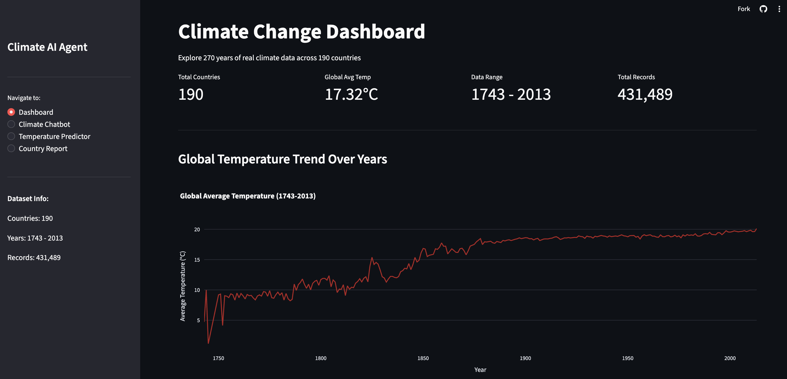
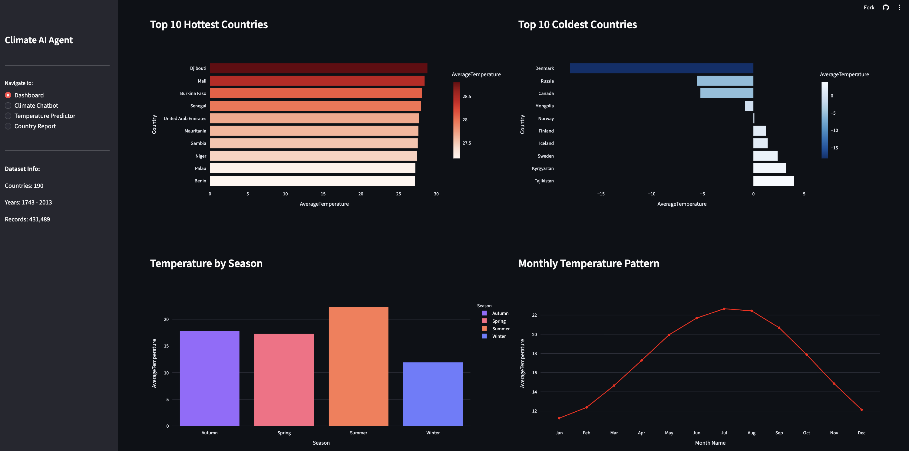
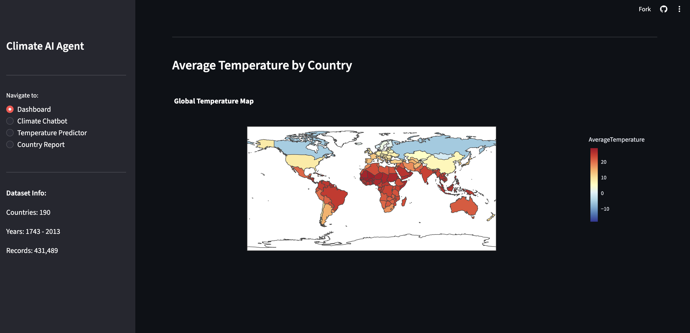
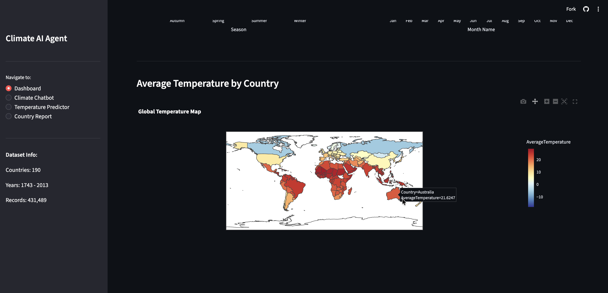
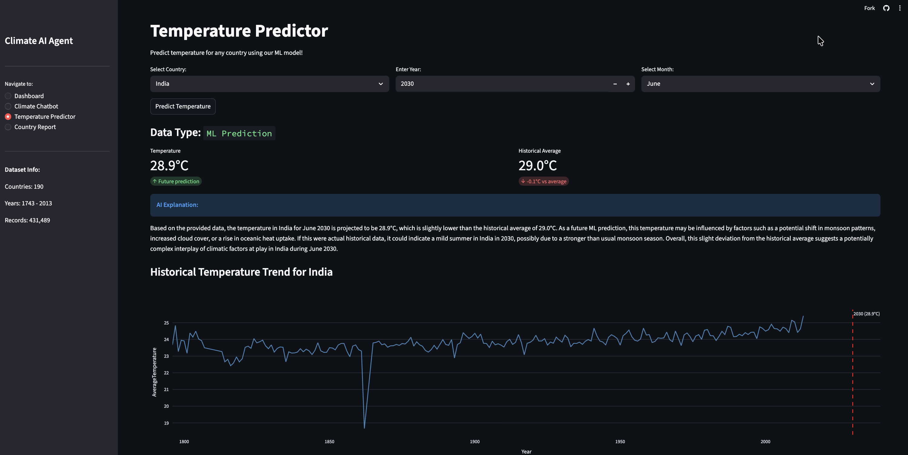
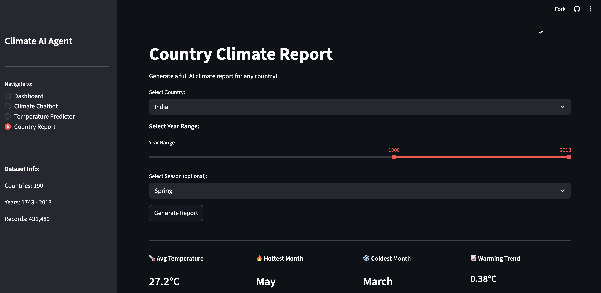
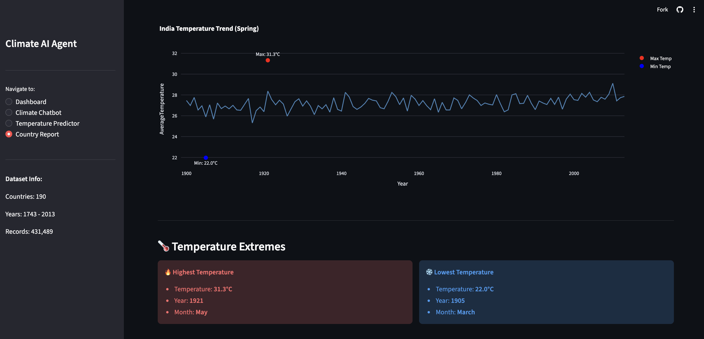
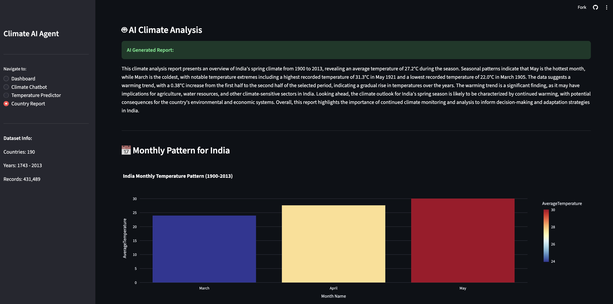

# 🌍 Climate Change Analysis and Prediction Using Machine Learning and AI

An end-to-end intelligent Climate Change Analysis and Prediction System 
built using Machine Learning and Artificial Intelligence — analyzing 
270 years of real climate data across 190 countries.

## 🔗 Live App
👉 [Click here to open the app](https://climateaiapp-byvishistsharma.streamlit.app)

> **⚠️ Note:** The app is kept alive automatically via GitHub Actions 
> running every 10 hours. If the app is sleeping, 
> it may take 2-3 minutes to wake up on first visit.

---

## 📊 Project Overview

| Detail | Value |
|---|---|
| **Dataset** | GlobalLandTemperaturesByCountry — Berkeley Earth |
| **Data Source** | Kaggle |
| **Countries** | 190 unique countries |
| **Records** | 431,489 temperature readings |
| **Time Period** | 1743 to 2013 (270 years) |
| **ML Model** | Random Forest Regressor |
| **R² Score** | 0.98 (98% accuracy) |
| **MAE** | 0.979°C |
| **AI Model** | Groq LLaMA 3.3 70B |

---

## 🚀 Features

### 📈 Dashboard
- Interactive climate visualizations using Plotly
- KPI cards showing key climate statistics
- Global temperature trend line chart (1743-2013)
- Top 10 hottest and coldest countries
- Temperature by season and monthly patterns
- World choropleth map showing temperature by country

### 🤖 Climate Chatbot
- AI powered Q&A on climate dataset
- Answers questions using 270 years of real climate data
- Powered by Groq LLaMA 3.3 70B

### 🌡️ Temperature Predictor
- For years ≤ 2013 → shows actual historical data
- For years > 2013 → ML model predicts future temperature
- AI explanation of prediction in natural language
- Historical trend chart with selected year marker

### 📄 Country Climate Report
- Year range slider (1743-2013)
- Season filter (All, Summer, Spring, Autumn, Winter)
- Temperature extremes (max and min with year and month)
- AI generated professional climate analysis report
- Monthly temperature pattern chart

---

## 🛠️ Tech Stack

| Category | Technology |
|---|---|
| Language | Python 3.x |
| Development | Google Colab |
| ML Library | Scikit-learn |
| Data Library | Pandas, Numpy |
| Visualization | Matplotlib, Seaborn, Plotly |
| Web Framework | Streamlit |
| AI API | Groq (LLaMA 3.3 70B) |
| Version Control | GitHub |
| Model Storage | Google Drive |
| Deployment | Streamlit Cloud |

---

## 📁 Project Structure

ClimateAIApp/
├── .github/
│   └── workflows/
│       └── keep_awake.yml                       # GitHub Actions keep alive
├── app.py                                       # Main Streamlit application
├── requirements.txt                             # Python dependencies
├── GlobalLandTemperaturesByCountry_Cleaned.csv  # Dataset
├── .gitignore                                   # Git ignore file
└── README.md                                    # Project documentation

---

## ⚙️ How It Works

Dataset (Berkeley Earth)
↓
Google Colab (EDA + ML Training)
↓
Trained Model saved to Google Drive
↓
Streamlit app downloads model at runtime
↓
Groq AI API provides natural language insights
↓
Users access via public Streamlit URL

---

## 📦 Installation (Local)
```bash
# clone repository
git clone https://github.com/sharmavishist/ClimateAIApp.git

# navigate to folder
cd ClimateAIApp

# install dependencies
pip install -r requirements.txt

# run app
streamlit run app.py
```

---

## 🤝 Challenges Faced

- **Redundant Countries** — Dataset had 200+ entries including duplicates like
  "France" and "France (Europe)" — cleaned to 190 unique countries
- **Synthetic Data** — Initial dataset was synthetic — switched to real 
  Berkeley Earth dataset improving accuracy from negative R² to 98%
- **Model File Size** — Trained model was 920.07MB — solved using Google Drive
  for public model hosting
- **API Credits** — Switched from Claude/Gemini to Groq API for free access
  to LLaMA 3.3 70B model
- **Git LFS Budget** — Exceeded GitHub LFS free tier — resolved using 
  Google Drive instead

---

## 📈 Model Performance

| Metric | Value | Interpretation |
|---|---|---|
| R² Score | 0.98 | Model explains 98% of temperature variations |
| MAE | 0.979°C | Predictions accurate within 1°C |
| Training Data | 80% of dataset | 345,191 records |
| Testing Data | 20% of dataset | 86,298 records |

---

## ⚠️ Disclaimer

- ML model hosted on Google Drive — downloaded automatically at runtime
- App deployed on Streamlit Cloud free tier
- First load may take 5-10 minutes due to model download
- Data covers 1743-2013 — predictions beyond 2013 are ML estimates
- GitHub Actions workflow pings app every 10 hours to prevent sleeping

---

## 👨‍💻 Developer

- **Name:** Vishisth Sharma
- **GitHub:** [@sharmavishist](https://github.com/sharmavishist)
- **Live App:** [climateaiapp-byvishistsharma.streamlit.app](https://climateaiapp-byvishistsharma.streamlit.app)

---

## 📸 Screenshots

### 🌍 Dashboard









